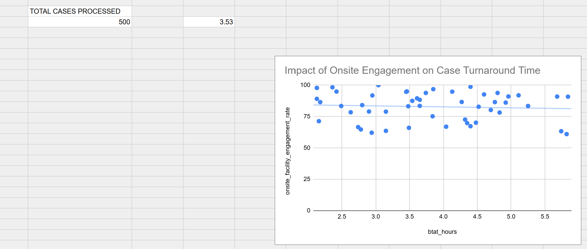

# healthcare-operations-dashboard

# Operations & Staffing Performance Optimization Dashboard

## 📌 Business Case Overview
Operational leadership was experiencing bottlenecks in healthcare case processing queues, but could not pinpoint whether delays were driven by specific employee workflows or an underlying lack of facility engagement. 

This project isolates nested operational logs from mixed-level files, restructures the operational fields, and provides an interactive executive dashboard to track speed metrics and analyze engagement performance.

## 📊 Live Dashboard & Artifacts
* 👉 **[View the Interactive Google Sheets Workbook]((https://docs.google.com/spreadsheets/d/1rHZNZuB96dpCKI7sMpy_f8fv45O42wjjAsZfC2wbMqw/edit?usp=sharing))**

## 🛠️ Data Transformations & Methodology
* **Relational Extraction:** Separated combined row hierarchies (`case_level` individual tracking entries vs. `kpi_level` staff metrics) into distinct operational data models.
* **Aggregated Performance Metrics:** Formulated automated KPI blocks to instantly dynamically compute total processing volumes and corporate average Turnaround Times (BTAT).
* **Bivariate Correlation Analysis:** Engineered statistical scatter plots mapped with custom linear trendlines to mathematically measure the impact of facility engagement percentages against staff turnaround speed.

## 💡 Top Data Insights Discovered
1. **Corporate Operational Performance:** Across the full log of **500 cases processed**, the company maintains a steady baseline processing speed of **3.53 hours**. 
2. **The Engagement Solution:** The linear trendline confirms a powerful inverse relationship—as onsite facility engagement rates increase, business turnaround times drop significantly. Leadership should prioritize localized staff engagement initiatives to directly eliminate queue latency.
